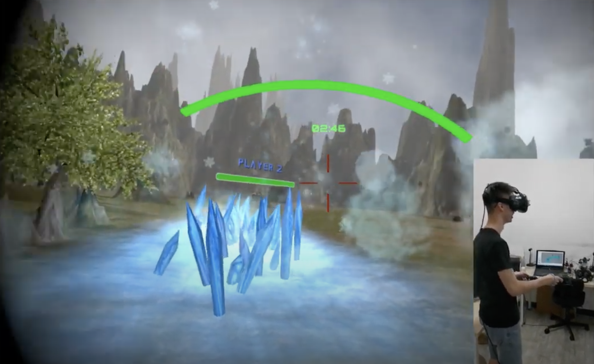
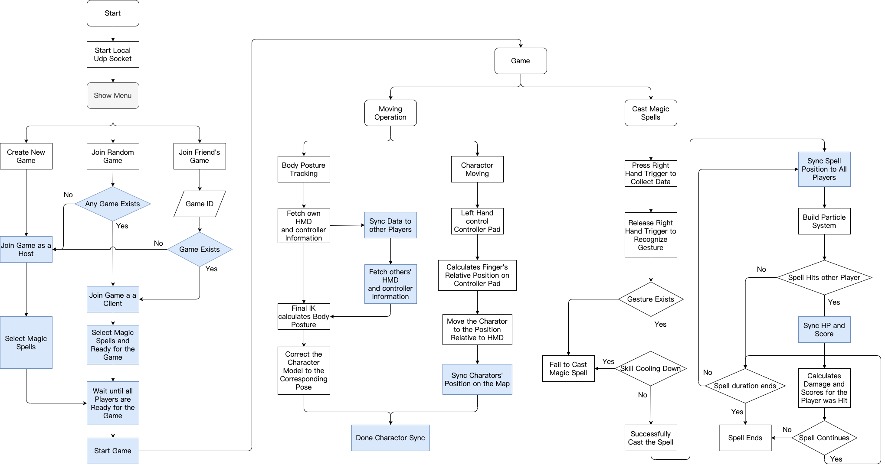

<div>
	<h1 style="display:inline;"> Enchanter </h1> 
	<a href="https://github.com/PKhuang-TW/Enchanter"> [Code] </a> 
</div>

---

<!-- PROJECT LOGO -->
<br />
<p align="center">
    
  </a>
  <h3 align="center">Enchanter</h3>
  <p align="center">
    Multiplayer VR Game with Gesture Recognition
    <br />
    <a href="https://www.youtube.com/watch?v=ky6uT86vLYI&t">View Demo</a>
    .
    <a href="https://github.com/PKhuang-TW/Enchanter/tree/master/GameFolder">Game EXE file</a>
    .
    <a href="https://github.com/PKhuang-TW/Enchanter/tree/master/UnityPackage">Unity Package</a>
  </p>
</p>

<!-- ABOUT THE PROJECT -->
## About The Project

This is a **Multiplayer VR Game** with **Gesture Recognition**. Players fight against each other by casting magic spells drew by their VR controller. Enchanter is developed on HTC VIVE, and [Photon](https://www.photonengine.com/zh-TW/Photon) is used to synchronize the connection. A CNN model is trained to recognize gestures, with five spell symbols and one noise category. We have designed a total of nine skills, each of which has its own characteristics. Players can choose five corresponding spell symbols in the lobby. In addition, in order to prevent dizziness when the player moves in the game, we narrowed the field of view when the user turns his head or moves in the game.

- [x] Terrain and Surroundings
- [x] Skill Effects
- [x] Gesture Recognition
- [x] Support up to 4 players




### Built With

* [Unity 2017.4.1](https://unity3d.com)
* [Python 3.6](https://www.python.org/downloads/release/python-360/)
* [CUDA 9.0](https://developer.nvidia.com/cuda-90-download-archive)
* [Pytorch](https://pytorch.org) - Has to mactch the version of Python and CUDA.
* [Photon](https://www.photonengine.com/zh-TW/Photon)
* [Final IK](https://assetstore.unity.com/packages/tools/animation/final-ik-14290?gclid=Cj0KCQjwufn8BRCwARIsAKzP6967iMRUnoCr9pBa3LgBCQehINS8GzqnlY0Hh_iXk-BvSXZcUF8JLt4aAlIDEALw_wcB)
* [Photoshop](https://www.adobe.com/tw/products/photoshop.html)

### Procedure



<!-- GETTING STARTED -->
## Getting Started

To start playing Enchanter, Python 3.6 and CUDA 9.0 has to be installed. Pytorch version has to match versions of Python and CUDA. On the other hand, Enchanter operates a local python server at background, so there are several python packages necessary.

### Installation

1. **Pytorch** - If you can't find the installation method of pytorch:
```sh
./NecessaryPackage/Pytorch_Python36_CUDA9.bat
```
2. **Python Packages** - There are several packages like: sockets, tqdm.... have to be installed:
```sh
./NecessaryPackage/PythonPackage.bat
```
3. Download whole Pack of "Enchanter" and exucute "Enchanter.exe" to play the game.
