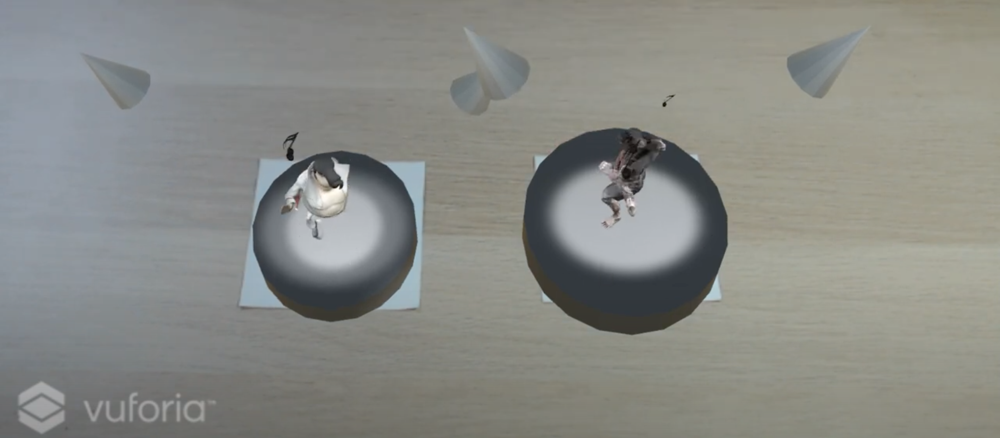

### Sync FIFO UVM Verification IP

  <table>
    <tr>
      <th
        class = "imageColumn">
            
          </a>
      </th>
      <th class="textColumn">
        

          <a href="https://github.com/PKhuang-TW/pkhuang_sync_fifo_vip" target="_blank">[Github]</a>
        

        

          A reusable UVM-based verification IP for synchronous FIFO. It includes configurable depth/width,
          <strong>active and passive agents, scoreboard with reference model, and functional coverage</strong>.
          Supports blocking read/write and checks full/empty behavior and data integrity.
        

      </th>
    </tr>
  </table>

---

### Counter UVM Verification IP

  <table>
    <tr>
      <th
        class = "imageColumn">
            
          </a>
      </th>
      <th class="textColumn">
        

          <a href="https://github.com/PKhuang-TW/pkhuang_up_down_counter_vip" target="_blank">[Github]</a>
        

        

          A simple 3-bit up-down counter with direction control and edge-triggered reverse logic. It counts from 0 to 7 and back, automatically changing direction at the boundaries. Supports manual direction reversal through a one-cycle reverse signal.
        

      </th>
    </tr>
  </table>

<!-- ---
### [Multi-Style Semantic Style Transfer](/MultiStyleNST/)

  <table>
    <tr>
      <th
        class = "imageColumn">
            
          </a>
      </th>
      <th
        class = "textColumn">
            This project is aimed to transfer different semantic objects in one image into different styles. We use pretrained semantic segmentation model (DeepLab-V3) to get the foregound and backgound region, and apply style transfer on different style for each region. In addition to style loss and content loss in traditional neural style transfer, we futher add style-blending loss and total variance loss to make the result more harmony when blending very different style. Also, we provide custom control of blending effect. 
      </th>
    </tr>
  </table>

---

### [Enchanter](/Enchanter/)

  <table>
    <tr>
      <th
        class = "imageColumn">
            
          </a>
      </th>
      <th
        class = "textColumn">
            This is a <b>Multiplayer VR Game</b> with <b>Gesture Recognition</b>. Players fight against each other by casting magic spells drew by their VR controller. Enchanter is developed on HTC VIVE, and <a href="https://www.photonengine.com/zh-TW/Photon">Photon</a> is used to synchronize the connection. A CNN model is trained to recognize gestures, with five spell symbols and one noise category. We have designed a total of nine skills, each of which has its own characteristics. Players can choose five corresponding spell symbols in the lobby. In addition, in order to prevent dizziness when the player moves in the game, we narrowed the field of view when the user turns his head or moves in the game.
      </th>
    </tr>
  </table>

---

### [Love is in the Air](https://bldpiqo.wixsite.com/ucidgroup1)

  <table>
    <tr>
      <th
        class = "imageColumn">
            
          </a>
      </th>
      <th
        class = "textColumn">
            Couples tend to meetup regularly to maintain the relationship, and to keep in touch. Some of them might be disappointed by the distance or meetup frequency. We’d like to build the network to support these relationships, make them feel secure in the relationship. We conduct an interview and build up an affinity wall to narrow down to several key findings. A <b>Mouse</b> for couples is our design solution after creating personas. Finally, an usability test is conducted to evaluate our system.
      </th>
    </tr>
  </table>

---

### [Music Box](/MusicBox/)

  <table>
    <tr>
      <th
        class = "imageColumn">
        
      </th>
      <th
        class = "textColumn">
            This is a <b>Self-Made Music Box</b> built with Arduino. Music will be read through SD module (LC-SD) and output by a 8-Ohm 2W speaker. Buttons on the box supports <b>Play/Stop, Next/Previous</b> LCD was prepared to show music name. However, the LCD module doesn't support Traditional Chinese output, so the LCD was not implemented in this project finally.
      </th>
    </tr>
  </table>

---

### [CoinForest](/CoinForest/)

  <table>
    <tr>
      <th
        class = "imageColumn">
        
      </th>
      <th
        class = "textColumn">
            This is a <b>PC Game</b> built by Unity 3D. There are 10 coins in the world, player can either play again or exit after collecting all the coins. <I>Due to the computer performance is not very good, the recorded video is a bit lag, but there is no such phenomenon when playing.</I>
      </th>
    </tr>
  </table>

---

### [iRing](/iRing/)

  <table>
    <tr>
      <th
        class = "imageColumn">
        
      </th>
      <th
        class = "textColumn">
            This is a intelligent ring using <b>Infrared Reflection</b>. 4 IR sensors are attached on the 3D-printed Ring. Data from each sensor were collected in four states and was used to recognize current states in real time. The states are determined by the distance between finger and ring since the result will be different in each situation. Arduino and Python are used to collect data; Processing is used to build the interface.
      </th>
    </tr>
  </table>

---

### [HappyDancing](/HappyDancing/)

  <table>
    <tr>
      <th
        class = "imageColumn">
        
      </th>
      <th
        class = "textColumn">
            Two AR character are assigned to two QR codes in this project, and will dance to each other while they meet in AR world. Dancing animation and music will begin when they start dancing.
      </th>
    </tr>
  </table>

 -->